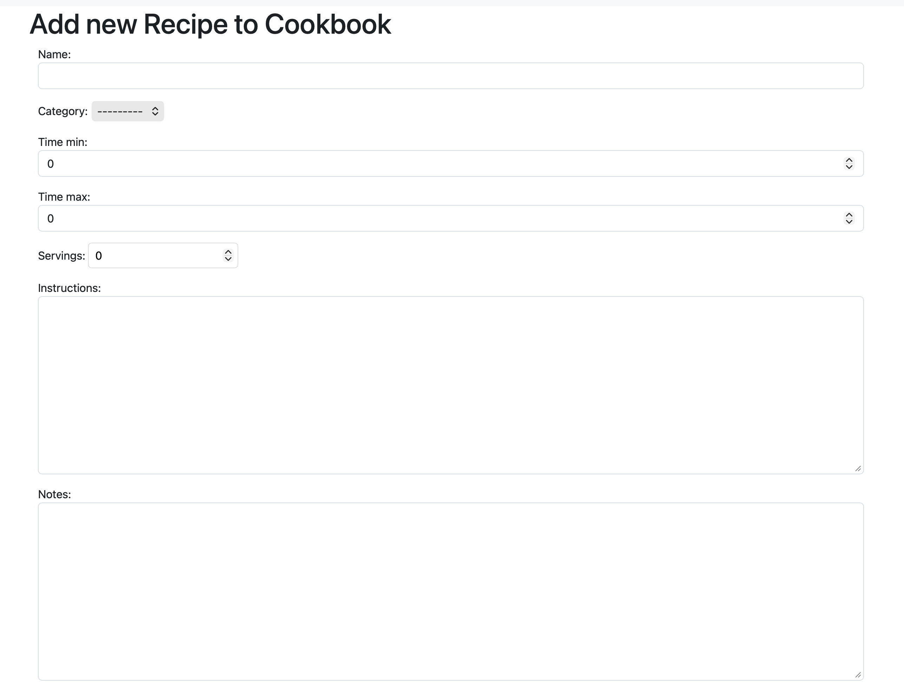
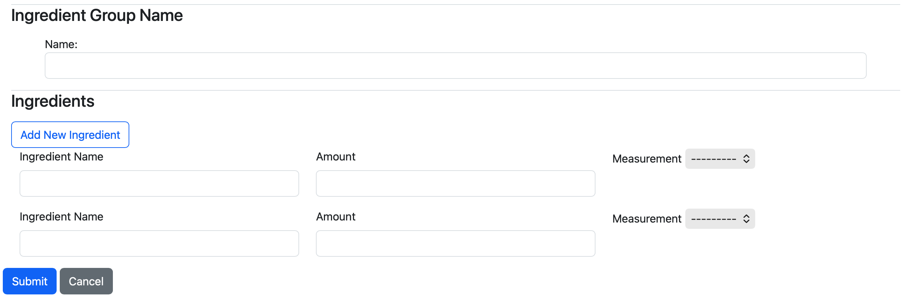
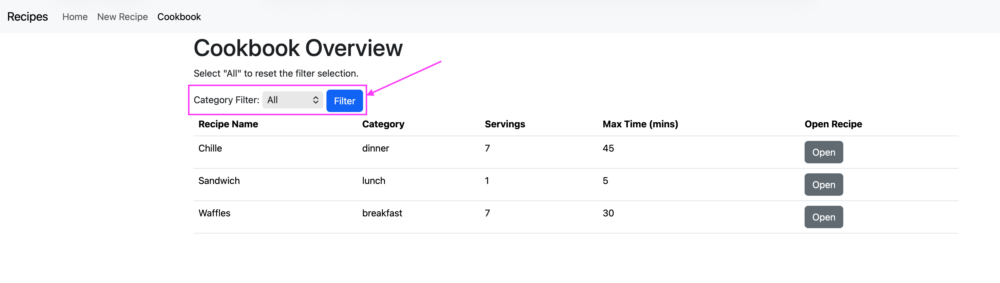
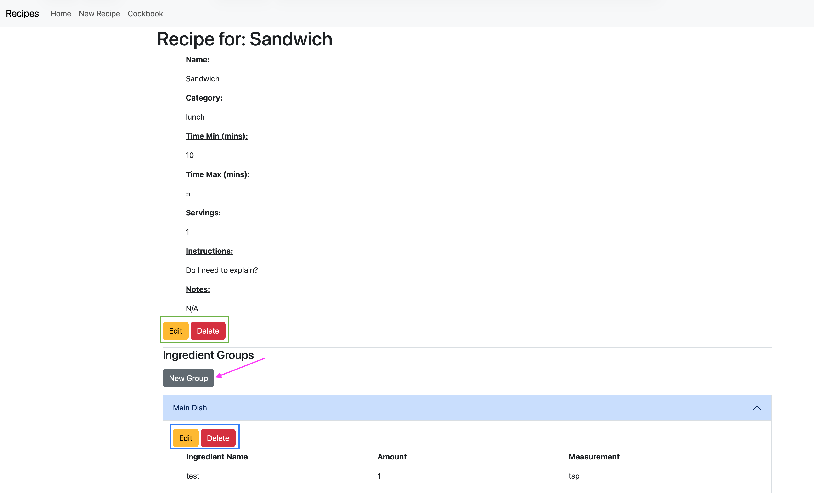

<!--Helps with compatibility of the back to top link-->

<!--PROJECT SHIELDS-->
[![Contributors][contributors-shield]][contributors-url]
[![Forks][forks-shield]][forks-url]
[![Stargazers][stars-shield]][stars-url]
[![Issues][issues-shield]][issues-url]
[![MIT License][license-shield]][license-url]

<!-- Project Title -->
 

    <h1 style="text-align:center">Recipe Database Website</h1>

<!-- Table of Contents -->

    
Table of Contents

    <ol>
        <li><a href="#about-the-repo">About The Repo</a></li>
        <li><a href="#built-with">Built With</a></li>
        <li><a href="#getting-started">Getting Started</a></li>
        <li><a href="#Using">Using</a></li>
        <li><a href="#contact">Contact</a></li>
        <li><a href="#acknowledgments">Acknowledgments</a></li>
    </ol>

 

# About the Repo
A personal project to create a local website to store recipes. The main goal was to allow someone to save a recipe they
like and be able to search for it again. 
Each recipe is given a tag that categorizes it--breakfast, lunch, dinner, snack, etc. And each recipe can have
multiple Ingredient Groups, a way to organize the ingredients to into separate groups (EX: the main dish versus the dressing)
and/or create an Ingredient Group that uses different ingredients than the recipe. 
This project utilized Docker, PostgreSQL and Nginx to allow the ability to host the website off a dedicated computer,
server, or Raspberry Pi to allow access within a local network. Basically a production ready version of the website.

(<a href="#readme-top">Back To Top</a>)

# Built With
* [![Python][python-shield]][python-url]
* [![django][django-shield]][django-url]
* [![Bootstrap][bootstrap-shield]][bootstrap-url]
* [![HTML5][html-shield]][html-url]
* [![JavaScript][javascript-shield]][javascript-url]
* [![PostgreSQL][postgresql-shield]][postgresql-url]
* [![Nginx][nginx-shield]][nginx-url]
* [![Docker][docker-shield]][docker-url]

(<a href="#readme-top">Back To Top</a>)

# Getting Started
There are two ways to run this website--via an Python IDE or Docker. Below I will show how to get started
with either option.

## Python IDE
First step is to download Python onto your personal computer and a Python IDE. Once you have Python and an IDE installed
on your computer, you can either download a copy of the repo to your local computer or fork it. 
Open the project in your IDE and created a venv within the project folder, you can run the following command in the IDE 
terminal to get the necessary libraries installed.
  
``
pip install -r requirements.txt
``
  
With the libraries installed we can next make any migrations, if any, and create the SQLite database. To do this, we run
the following two commands in order.
  
 ``
python manage.py makemigrations
 ``
 
``
python manage.py migrate
``
  
With the sqlite database and the migrations created, we can now run the following command to start the server.
  
``
python manage.py runserver
``
  
Click the link that shows up in the terminal to see the website or type in "localhost:8000" in your computer browser.

## Docker
Download a copy of the repo to your local computer or fork it on Github. Next go to
<a href="https://www.docker.com">Docker Website</a> and download the latest version of Docker desktop. Once you have
installed Docker Desktop onto your computer and have it running, you can open a terminal on your computer and cd
to where you save the copy of this repo on your computer. 
If you wish to run this off a dedicated computer to allow access to within your home's network, you will need to update
the prod.env file. Open the file in a text-editor or in the terminal and add your computer's IP address to the
ALLOWED_HOSTS line, within the single-quotes, after localhost with a comma between localhost and your computer's IP
address as shown below.
  
``
ALLOWED_HOSTS='localhost,your_computer_ip_address'
``
  
With or without the prod.env file updated with your computer's IP address run the following command to have Docker
build the necessary images and spin up the containers.
  
``
docker compose up -d --build
``
  
You can validate that the containers have been properly spun up via the Docker desktop. If didn't modified the prod.env
file, then open a browser on your computer and go to "localhost"; if you did add in the computer's IP address that is
hosting the Docker containers, you can enter the computer's IP address on any device or computer that is connected in
your household network.

(<a href="#readme-top">Back To Top</a>)

# Using
## Creating a new Recipe
Select the "new recipe" on the navbar.

 
Next fill the form for the recipe, ingredient group, and the ingredients part of the group. Please note that you will
need at lest one ingredient in the ingredient group to be allowed to save the form. When you are finished, click the
"submit" button

## Seeing all Recipes
Select the "Cookbook" on the navbar.

 
You can use the filer to view only recipes of a specific category--lunch, dinner, etc. Once you find the recipe you wish to view simple
click the open button.

## Viewing / Editing Existing Recipe
With a selected recipe open, you can edit the recipe details (green box), any edit an ingredient group (blue box),
or create a new ingredient group via the "new group" button (pink arrow). 
You can also delete the recipe, which in turn deletes all ingredient group(s) associated with the recipe or delete one
ingredient group. Please note that each recipe must have at lest one ingredient group; the website will inform you of
this.

(<a href="#readme-top">Back To Top</a>)

<!-- Contact -->
# Contact
Please head to my portfolio website and use the contact form to reach out to me:
[My Portfolio Website][portfolio-url]

(<a href="#readme-top">back to top</a>)

<!-- ACKNOWLEDGMENTS -->
# Acknowledgments

* [Choose an Open Source License](https://choosealicense.com)
* [Img Shields](https://shields.io)

(<a href="#readme-top">Back To Top</a>)

<!-- MARKDOWN LINKS & IMAGES -->
[contributors-shield]: https://img.shields.io/github/contributors/ColorlessSaber/recipe-database-website.svg?style=for-the-badge
[contributors-url]: https://github.com/ColorlessSaber/recipe-database-website/graphs/contributors
[forks-shield]: https://img.shields.io/github/forks/ColorlessSaber/recipe-database-website.svg?style=for-the-badge
[forks-url]: https://github.com/ColorlessSaber/recipe-database-website/network/members
[stars-shield]: https://img.shields.io/github/stars/ColorlessSaber/recipe-database-website.svg?style=for-the-badge
[stars-url]: https://github.com/ColorlessSaber/recipe-database-website/stargazers
[issues-shield]: https://img.shields.io/github/issues/ColorlessSaber/recipe-database-website.svg?style=for-the-badge
[issues-url]: https://github.com/ColorlessSaber/recipe-database-website/issues
[license-shield]: https://img.shields.io/github/license/ColorlessSaber/recipe-database-website.svg?style=for-the-badge
[license-url]: https://github.com/ColorlessSaber/recipe-database-website/blob/main/LICENSE

[javascript-shield]: https://img.shields.io/badge/JavaScript-F7DF1E?style=for-the-badge&logo=javascript&logoColor=black
[javascript-url]: https://developer.mozilla.org/en-US/docs/Web/JavaScript
[html-shield]: https://img.shields.io/badge/HTML5-E34F26?style=for-the-badge&logo=html5&logoColor=white
[html-url]: https://html.spec.whatwg.org/multipage/
[css-shield]: https://img.shields.io/badge/CSS-663399?style=for-the-badge&logo=css&logoColor=white
[css-url]: https://www.w3.org/Style/CSS/Overview.en.html
[python-shield]: https://img.shields.io/badge/Python-3776AB?style=for-the-badge&logo=python&logoColor=white
[python-url]: https://www.python.org
[django-shield]: https://img.shields.io/badge/Django-092E20?style=for-the-badge&logo=django&logoColor=white
[django-url]: https://www.djangoproject.com/
[bootstrap-shield]: https://img.shields.io/badge/Bootstrap-563D7C?style=for-the-badge&logo=bootstrap&logoColor=white
[bootstrap-url]: https://getbootstrap.com
[postgresql-shield]: https://img.shields.io/badge/PostgreSQL-4169E1?style=for-the-badge&logo=postgresql&logoColor=white
[postgresql-url]: https://www.postgresql.org
[nginx-shield]: https://img.shields.io/badge/Nginx-009639?style=for-the-badge&logo=nginx&logoColor=white
[nginx-url]: https://nginx.org/en/
[docker-shield]: https://img.shields.io/badge/Docker-2496ED?style=for-the-badge&logo=docker&logoColor=white
[docker-url]: https://www.docker.com

[portfolio-url]: https://colorlesssaber.github.io/